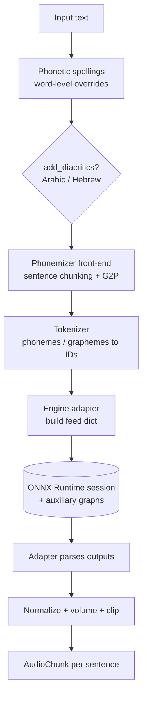

# Architecture

This page is for contributors and advanced users who want to understand how a string of
text becomes audio inside phoonnx. After reading it you will know which component owns each
step and where to plug in a new phonemizer, engine, or vocoder.

## The synthesis pipeline

`TTSVoice` (in `phoonnx/voice.py`) is architecture-agnostic: it drives the text→tokens
front-end and delegates everything ONNX-specific to an **engine adapter**. The same class
serves a single-graph VITS voice and a multi-graph flow-matching voice without changes.

Step by step, as implemented in `TTSVoice.synthesize`:

1. **Phonetic spellings** — when `enable_phonetic_spellings` is set, word-level
   replacements loaded from the voice's `locale/<lang>/phonetic_spellings.txt` are applied
   to the raw text.
2. **Diacritics** — for Arabic/Hebrew voices, `add_diacritics` runs the phonemizer's
   diacritization pass before G2P. A per-call `SynthesisConfig.add_diacritics` wins; when
   unset it defers to the voice config so an undiacritized model is never force-diacritized.
3. **Phonemize** — the selected [phonemizer](phonemizers.md) splits the text into sentences
   and converts each to a list of phoneme (or grapheme) strings. Inline `[[...]]` blocks
   bypass the phonemizer and are inserted verbatim. Language-aware phonemizers (Shami) emit
   per-phoneme language IDs through a `phonemize_with_language_ids` hook so the two streams
   stay aligned.
4. **Tokenize** — the `TTSTokenizer` maps phonemes/characters to integer IDs using the
   voice's `phoneme_id_map`, inserting blank/pad/bos/eos tokens per the voice config. For
   text-token engines (Chatterbox) the adapter's `encode_text` BPE-tokenizes the raw text
   instead.
5. **Adapter synthesize** — `phoneme_ids_to_audio` merges scale parameters (adapter defaults
   → voice config → per-call `SynthesisConfig` → engine extras), builds an
   `AdapterSynthesisRequest`, and hands it to the engine adapter, which runs the ONNX
   session(s) and returns a float32 waveform.
6. **Post-process** — the waveform is optionally peak-normalized, volume-scaled, and clipped
   to `[-1, 1]`, then yielded as one `AudioChunk` per sentence.

Text normalization of numbers, dates and units (via `ovos-number-parser` /
`ovos-date-parser`) is applied during dataset [preprocessing](training/preprocess.md) so
training text matches inference; individual phonemizer backends may additionally clean their
own input.

## Where the extension points live

| Concern | Owner | Registry / hook |
|---|---|---|
| Text → phonemes | `scriptconv.phonemizers` (delegated) | `get_phonemizer(phoneme_type, alphabet, model)` in `config.py` |
| Phonemes → IDs | `phoonnx/tokenizer.py` | `TTSTokenizer` built from the voice config |
| IDs → audio (ONNX I/O) | `phoonnx/engines/` | `register_engine(name, adapter_cls, detect_priority=...)` |
| Mel → waveform (two-stage) | `phoonnx/engines/vocoders/` | vocoder registry, selected by `vocoder_type` |
| Voice discovery / download | `phoonnx/model_manager.py` | `TTSModelManager`, bundled `voice_index/*.json` |

## Engine selection

At load time `TTSVoice` resolves an adapter in this order (`voice.py` + `engines/__init__.py`):

1. If the voice config declares an `engine`, the named adapter is used directly. The
   `piper`, `mimic3` and `coqui` engines all share the single **VITS** adapter.
2. Otherwise `detect_engine()` probes registered adapters in ascending `detect_priority`
   (lower is checked first) and returns the first whose `detect()` matches the config and
   ONNX session.
3. If nothing matches, it falls back to the VITS adapter.

The 17 declared engine formats and the adapter registry are documented in
[Engines](engines.md); voice-config detection of Piper/Mimic3/Coqui/Transformers shapes is
documented in the [Configuration reference](configuration.md).

## Two-stage engines and auxiliary graphs

Single-stage engines (VITS and its Piper/Mimic3/Coqui variants) emit a waveform directly.
Two-stage engines (Matcha, GlowTTS, MixerTTS, FastPitch) emit a mel spectrogram and pair
with a separate **vocoder** ONNX graph. Cloning and multi-graph engines load further
auxiliary graphs — speaker encoders (YourTTS), style encoders (StyleTTS2), text/flow decoders
(ZipVoice, F5-TTS), the four-graph codec-LM split (Chatterbox), or SuperTonic's four
flow-matching graphs. The voice manager
downloads these alongside the primary model and injects their local paths into
`engine_params`; every auxiliary session runs on the same execution providers as the voice.
See [Vocoders](vocoders.md) and the per-engine pages under
[training/engines/](training/engines/matcha.md).
